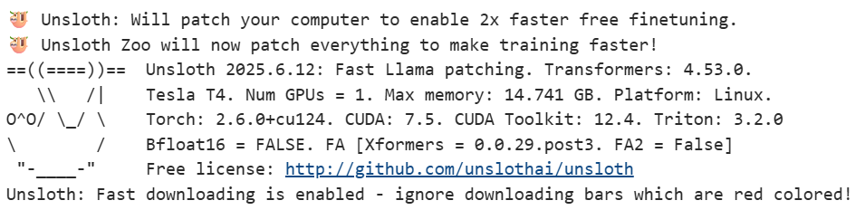

# VHDL_LLM - VHDL Dataset & LLM Tools

  

Tools for VHDL dataset processing, compilation verification, and LLM finetuning/inference using Unsloth for efficient training.

## Key Files & Datasets

### Datasets
- **`VHDL_compiling_excel.json`**: ~3k compiling VHDL files from excel data.
- **`hdl_coder_compiling.json`**: ~33k compiling files from the Hugging Face HDL-coder dataset.
- **`gen_vhdl_descriptions_merged.json`**: Dataset with generated multi-grained descriptions for HDL-coder.

### Scripts
- **`check_compiling_VHDL_v2.sh`**: Batch shell script to compile and verify VHDL files.
- **`batch_verilog_toVHDL.sh`**: Batch script for translating Verilog to VHDL.
- **`simple_vhdl_eval.py`**: A streamlined VHDL evaluation script (simpler alternative to Makefile-based approaches like Verilog-eval).

### LLM Notebooks
- **`Llama3_2_VHDL_2.ipynb`**: Finetuning Llama 3.2 using Unsloth for efficient 4-bit training.
- **`inferenceUnsloth.ipynb`**: Manual inference using Unsloth on finetuned models.

## Models
Finetuned model weights are available in the `finetuned_weigths` folder or via [Google Drive](https://drive.google.com/drive/folders/1ZWrec89GvavnCA9HtNKBb4mqjQIZYzjG?usp=drive_link).

## Usage
1. **Retrieve Data**: `python hdl_coder/retrieve.py` (Downloads subset to `hdl_coder/100/`)
2. **Verify Compilation**: `bash hdl_coder/100/check_comp_v2.sh` (or `check_compiling_VHDL_v2.sh` for root files)
3. **Evaluate**: `python simple_vhdl_eval.py`
4. **Train**: Open `Llama3_2_VHDL_2.ipynb` in Google Colab for finetuning with Unsloth
5. **Inference**: Use `inferenceUnsloth.ipynb` for testing trained models

## Requirements
- **Python**: `pandas`, `datasets`, `unsloth`, `transformers`
- **GHDL**: Required for compilation checks.
- **Google Colab**: Recommended for training (T4 GPU or better)

## Unsloth Benefits
This project uses [Unsloth](https://github.com/unslothai/unsloth) for:
- 🔥 2x faster training
- 🦙 30% less VRAM usage
- ✅ Support for Llama 3.2 (1B/3B models)
- 📦 4-bit quantization for efficient finetuning
